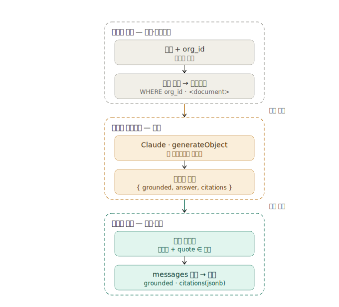

# Data Flow — GroundedDoc Prototype

The data flow for a construction-document Q&A app: upload a document, and the AI reads it and answers in plain English. There are two flows — the **upload flow** (a document comes in and is stored) and the **query flow** (a question comes out as a verified answer).

The one-line idea: **cage the risky thing (a probabilistic model) between two trustworthy deterministic steps.** The step in front controls *what can go in* (security); the step behind verifies *what came out* (quality).

---

## 1. Upload flow — from a chosen file to a stored document

```
choose a file
  → choose access_level (required, defaults to org_private)   ← secure by default
  → extract text (markdown, so a single file.text())
  → store the original in Supabase Storage (documents.storage_path)
  → store extracted text + org_id + title + doc_type in the documents row (documents.content)
```

**Why this order:**

- **`access_level` is taken *before* extraction.** If no permission is chosen, extraction and storage are blocked, so a document can never structurally reach the DB unlabelled. (In the single-user prototype it's a fixed value, but the flow is designed this way.)
- **This is where the original and the text part ways.** The extracted text is written into `documents.content` because the query flow reads it on *every* question — as context and as the source for citation verification. Re-fetching and re-extracting the original from Storage on every question would be slow and non-deterministic. The original stays in Storage for provenance/audit, the "view source" UX, and re-processing if extraction improves.

---

## 2. Query flow — three trust zones



Colour denotes the trust zone — **grey = deterministic code**, **amber = the probabilistic model (the risky zone)**, **teal = the verification gate that makes things safe again**. The model is caged inside the middle sandbox; both permission enforcement and output verification happen outside it, in deterministic code.

### Zone 1 — Deterministic (grey): permission ends here

The step that *fetches* documents is the entire security boundary. `org_id` (`WHERE org_id`) is the tenant guard — it is what makes leaking another org's document physically impossible — and `project_id` narrows the grounding set to the project's documents *within* that org. Once this step has selected only that project's documents (under the org tenant boundary) and built the context, **the most the model can ever see is already fixed.** Leaking another org's document is therefore impossible *because this SQL never fetched it* — the guarantee comes from the data-fetching step, not the prompt.

Wrapping each document in a `<document>` tag also happens here. It's a prompt-injection mitigation that pens the document text into a *data channel* so it can't blend into the instructions. (It's a mitigation, not a guarantee — the guarantee still comes from "you can't leak what was never fetched".)

### Zone 2 — Probabilistic (amber): the sandbox

The model sees *only* the context Zone 1 handed it. The worst that can happen here is a **quality failure** like a "hallucinated pay rate" — not a **security failure** that crosses a tenant boundary (there's nothing in the context to cross to).

The `grounded` boolean is the forcing function — it makes the model explicitly decide "is this in the document?" *before* writing the answer. Because the output is fixed to the shape `{ grounded, answer, citations }`, the next zone can verify it mechanically.

### Zone 3 — Deterministic (teal): turn a request into a check

Zone 2 *asked* the model to "do well"; here we **confirm it by machine**:

1. **Invariant** — if `grounded` is true there must be at least one citation; if false there must be zero.
2. **Source check** — each citation's `quote` must actually *exist* in `documents.content`. Even if the model fabricates a plausible "Per Clause 5.3…", it's caught when that sentence isn't in the source.

Only on passing do we store and return it in `messages` as `grounded` + `citations` (jsonb). Storing the citations as jsonb means the citation UI is reproduced on refresh without re-calling the model.

---

## 3. Two kinds of failure, two kinds of remedy

| | Quality failure | Security failure |
|---|---|---|
| Example | Miscalculated pay rate, citing a clause that doesn't exist | Exposing org B's document to org A |
| Acceptable probability | Can be lowered | **Must be zero** |
| Remedy | Prompt + schema (`grounded`) + verification gate | **Not left to the model — the fetch step + RLS** |
| Where it's handled | Zones 2–3 | Zone 1 (+ RLS in production) |

**A prompt is a strong prior, not a constraint.** It can lower P(bad), but never make it zero. So the security boundary is never left to the model; it's guaranteed at the data layer by the principle "the model can't leak what isn't in its context."

---

## 4. How this maps to the schema

- `documents.content` — Zone 1's context source and Zone 3's verification target.
- `documents.org_id` — Zone 1's tenant boundary (in production, RLS enforces isolation on this column).
- `documents.project_id` — Zone 1's grounding scope: narrows the fetch to the project's documents *within* the org tenant boundary.
- `documents.access_level` — the upload flow's secure-by-default (defaults to `org_private`).
- `messages.grounded` / `messages.citations` — where Zone 2's output is stored without loss.

> In the single-user prototype, RLS is OFF and the app runs on a fixed `DEMO_ORG_ID`. With no one to isolate from, the probability of a security failure is itself zero, and `org_id` remains an *expression of intent*. Where the guarantee actually lives (the RLS boundary) is spelled out at the bottom of [`../supabase/schema.sql`](../supabase/schema.sql).
